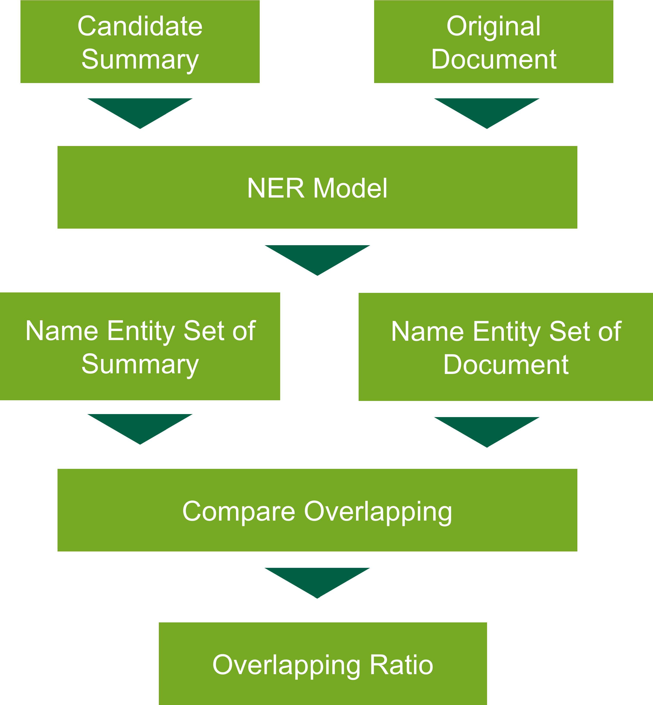
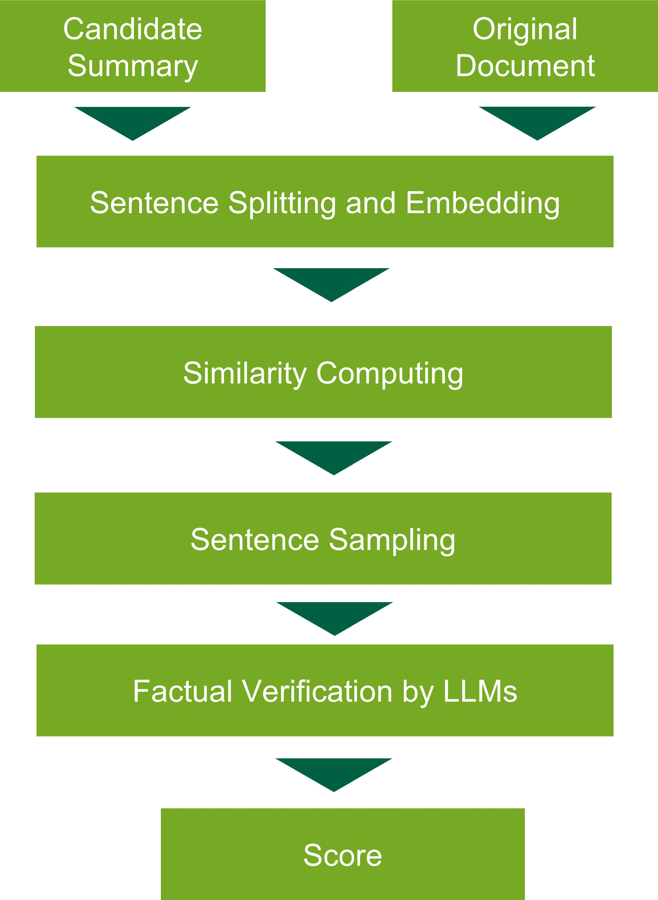

# Benchmarking LLM

## About The Project
Our project introduces a metric designed to evaluate the quality of textual summaries. This metric is pivotal in fields like finance, where precise information synthesis is critical.

* **Quality Discrimination**: Distinguishes effectively between superior and inferior summaries, ensuring clear differentiation in their factual accuracies.
* **Factual Accuracy Measurement**: Detects and quantifies any factual deviations, assigning lower scores to less accurate summaries.
* **Detail-Oriented Assessment**: Provides comprehensive evaluations, focusing on how well the summary captures the essence and details of the original text.
  
This metric is not merely a tool for evaluation; it's a step towards enhancing the integrity of information processing in sectors where factual accuracy is non-negotiable.

## Framework
**Named Entity Comparison**: Extract and compare financial-related named entities in texts. Analyzes and visualizes named entity accuracy and presence in summaries versus original texts.

    
    <figcaption>Named Entity Comparison</figcaption>

**Sentence-Level-based Summary Checking**: Applies LLMs to check the consistency between the summary and the original text sentence by sentence. Highlights and identifies inconsistencies between the summary and the original text for in-depth analysis.

    
    <figcaption>Sentence-Level-based Summary Checking</figcaption>

## Getting Started
### Dependencies

### Prerequisites

### Configuration

## Usage

## License
Distributed under the Apache-2.0 License. See `LICENSE.txt` for more information.

## Contact